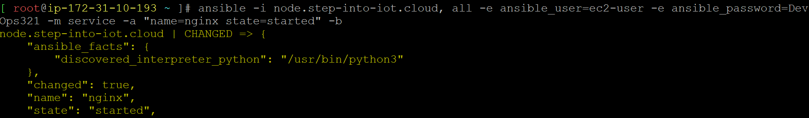

# Ansible 
- Ansible uses SSH Protocol
### configuration management
```
- install application runtime ..> java/nodejs/python
- install system packages
- install application dependencies
- download code
- create users, permission, directories
- create systemctl services
```
### configuration management → Push vs Pull
```
Ex: Friend send letter to you
Pull based __> every day we need to check DTDC office
Push based __> letter comes, DTDC delivery will deliver you

puppet, chef __> old __> Pull
Ansible      __> new __> Push & Pull

Disadvantages of Pull Model
- Increase Internet traffic
- unnecessary bandwidth consumption
- power & system resources waste
- cost 
```
### Create 2 VM's → Map to DNS
```
master __> master.step-into-iot.cloud
node   __> node.step-into-iot.cloud
```
### master
```
dnf install ansible -y
```
### Adhoc commands
- Ping Node __> -m means module
    
    ```
    ansible -i node.step-into-iot.cloud, all -e ansible_user=ec2-user -e ansible_password=DevOps321 -m ping
    ```
    
- Install Nginx __> -b means become root, -a means arguments
    ```
    ansible -i node.step-into-iot.cloud, all -e ansible_user=ec2-user -e ansible_password=DevOps321 -m dnf -a "name=nginx state=present" -b
    ```
    
    
- Start Nginx
    ```
    ansible -i node.step-into-iot.cloud, all -e ansible_user=ec2-user -e ansible_password=DevOps321 -m service -a "name=nginx state=started" -b
    ```
    
    

### Playbook
```
Adhoc    __> manual way  __> run each module 1 by 1.
Playbook __> yaml syntax __> keep all modules in single file, run that file.
```
### YAML  → yet another markup language
- based on indentation
```
name: naveen
dob: 01-09-2000
addresses:
- address-1: d-22
  city: hyderabad
- address-2: d-34
	city: bangalore
gender: male
```