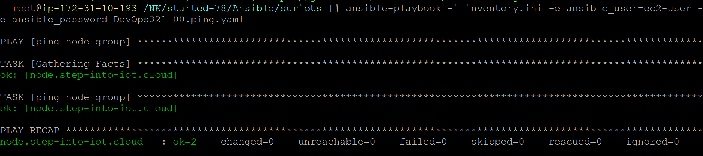

### Ping

00.ping.yaml
```
- name: ping node group
  hosts: node 
  tasks:
  - name: ping node group
    ansible.builtin.ping:
```
```
ansible-playbook -i inventory.ini -e ansible_user=ec2-user -e ansible_password=DevOps321 00.ping.yaml
```
#### playbook execution
