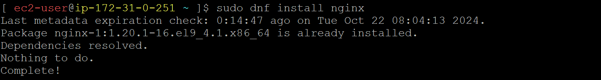

### nginx

02.nginx.yaml
```
- name: install nginx & start
  hosts: node
  become: true
  tasks:
  - name: install nginx
    ansible.builtin.package:
      name: nginx
      state: latest
      
  - name: start nginx
    ansible.builtin.service:
      name: nginx
      state: started
      enabled: yes
```
```
ansible-playbook -i inventory.ini -e ansible_user=ec2-user -e ansible_password=DevOps321 02.nginx.yaml
```
#### playbook execution

#### check nginx installed or not
