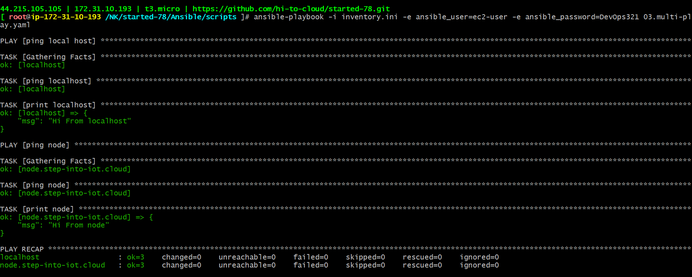

### multiple playbooks

03.multi-play.yaml
```
- name: ping local host
  hosts: localhost
  tasks:
  - name: ping localhost
    ping:
  - name: print localhost
    debug:
      msg: "Hi From localhost"

- name: ping node
  hosts: node
  tasks:
  - name: ping node
    ping:
  - name: print node
    debug: 
      msg: "Hi From node"
```
```
ansible-playbook -i inventory.ini -e ansible_user=ec2-user -e ansible_password=DevOps321 02.nginx.yaml
```
#### playbook execution
