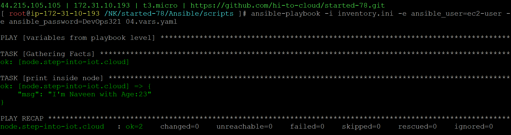

### variables from playbook level
04.vars.yaml
```
- name: variables from playbook level
  hosts: node
  vars:
    NAME: "Naveen"
    AGE: 23
  tasks:
  - name: Say Hi From Web
    ansible.builtin.debug:
      msg: "I'm {{NAME}} with Age:{{AGE}}"
```
```
ansible-playbook -i inventory.ini -e ansible_user=ec2-user -e ansible_password=DevOps321 04.vars.yaml
```
#### playbook execution
