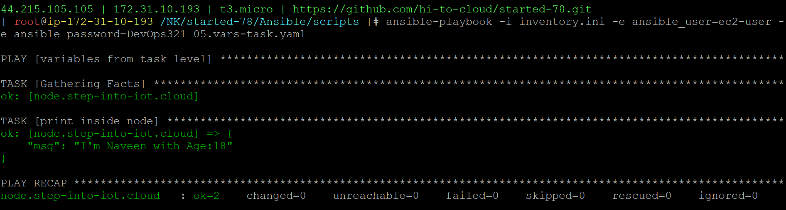

### variables from task level
05.vars-task.yaml
```
- name: variables from task level
  hosts: web
  vars:
    NAME: "Naveen"
    AGE: 23
  tasks:
  - name: Say Hi From Web
    vars:
      AGE: 18
    ansible.builtin.debug:
      msg: "I'm {{NAME}} with Age:{{AGE}}"
```
```
ansible-playbook -i inventory.ini -e ansible_user=ec2-user -e ansible_password=DevOps321 05.vars-task.yaml
```
#### playbook execution

