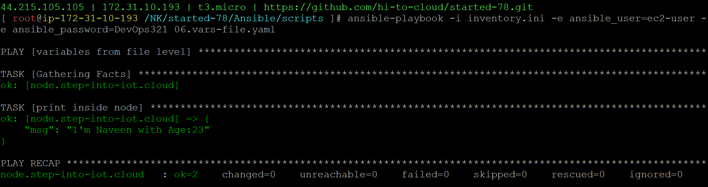

### variables from file level
06.vars-file.yaml
```
- name: variables from file level
  hosts: node
  vars_files:
    - 06.var-file.yml
  tasks:
  - name: print inside node
    ansible.builtin.debug:
      msg: "I'm {{NAME}} with Age:{{AGE}}"
```
06.var-file.yml
```
NAME: "Naveen"
AGE: 23
```
```
ansible-playbook -i inventory.ini -e ansible_user=ec2-user -e ansible_password=DevOps321 06.vars-file.yaml
```
#### playbook execution

