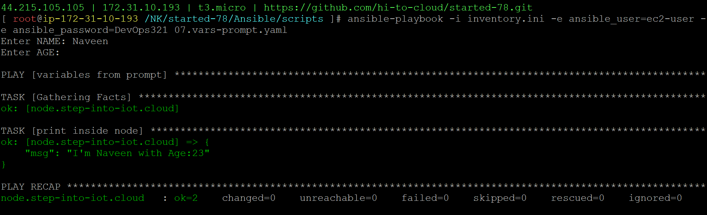

### 
07.vars-prompt.yaml
```
- name: variables from prompt
  hosts: node
  vars_prompt:
  - name: NAME
    prompt: Enter NAME
    private: false
  - name: AGE
    prompt: Enter AGE
    private: true
  tasks:
  - name: print inside node
    ansible.builtin.debug:
      msg: "I'm {{NAME}} with Age:{{AGE}}"
```
```
ansible-playbook -i inventory.ini -e ansible_user=ec2-user -e ansible_password=DevOps321 07.vars-prompt.yaml
```
#### playbook execution
