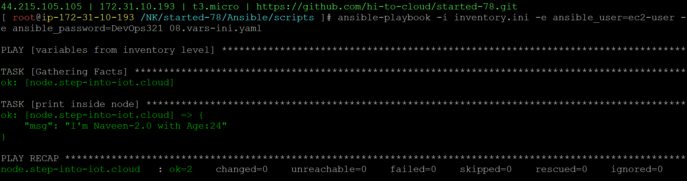

### variables from inventory level
08.vars-ini.yaml
```
- name: variables from inventory level
  hosts: node
  tasks:
  - name: print inside node
    ansible.builtin.debug:
      msg: "I'm {{NAME}} with Age:{{AGE}}"
```

### Add below in inventory.ini
```
[node:vars]
NAME="Naveen-2.0"
AGE=24
```
```
ansible-playbook -i inventory.ini -e ansible_user=ec2-user -e ansible_password=DevOps321 08.vars-ini.yaml
```
#### playbook execution
