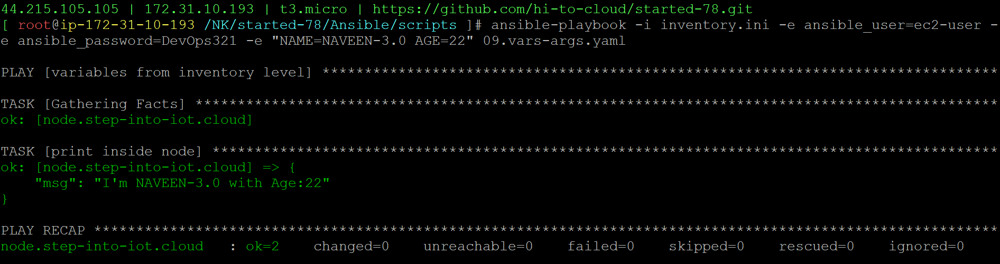

### variables from args level
09.vars-args.yaml
```
- name: variables from args level
  hosts: node
  tasks:
  - name: print inside node
    ansible.builtin.debug:
      msg: "I'm {{NAME}} with Age:{{AGE}}"
```
```
ansible-playbook -i inventory.ini -e ansible_user=ec2-user -e ansible_password=DevOps321 -e "NAME=NAVEEN-3.0 AGE=22" 09.vars-args.yaml
```
```
ansible-playbook -i inventory.ini -e ansible_user=ec2-user -e ansible_password=DevOps321 -e NAME=NAVEEN-3.0 -e AGE=22 09.vars-args.yaml
```
#### playbook execution
