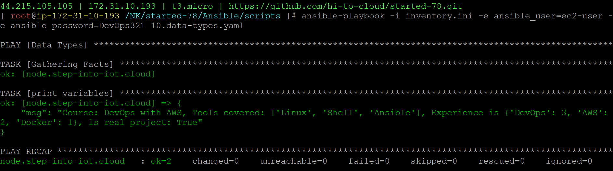

### Data Types

10.data-types.yaml
```
- name: Data Types
  hosts: node
  vars:
    COURSE: DevOps with AWS #string
    TOOLS: # list
    - Linux
    - Shell
    - Ansible
    EXPERIENCE: # map or dictionary
      DevOps: 3 # number
      AWS: 2
      Docker: 1
    REALTIMEPROJECT: true #boolean
  tasks:
  - name: print variables
    ansible.builtin.debug:
      msg: "Course: {{COURSE}}, Tools covered: {{TOOLS}}, Experience is {{EXPERIENCE}}, is real project: {{REALTIMEPROJECT}}"
```
```
ansible-playbook -i inventory.ini -e ansible_user=ec2-user -e ansible_password=DevOps321 10.data-types.yaml
```
#### playbook execution
