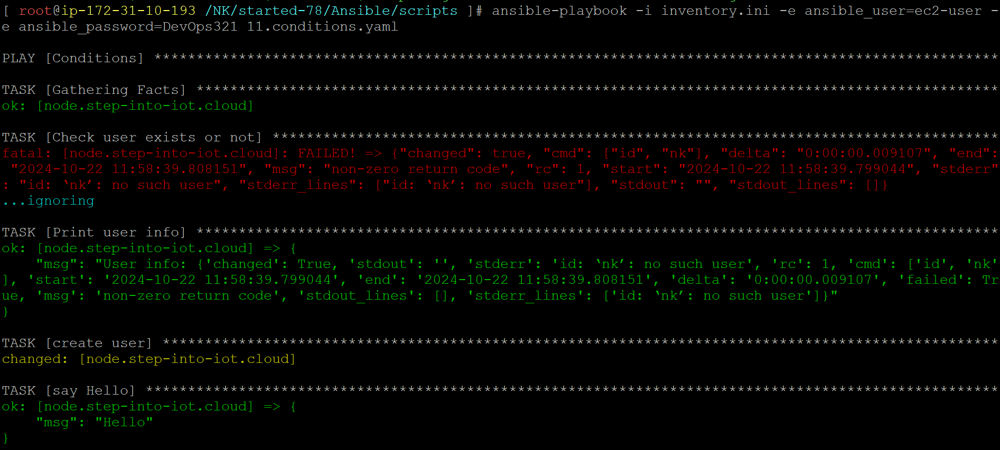
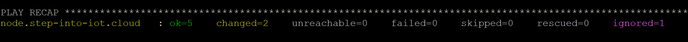

### conditions

11.conditions.yaml
```
- name: Conditions
  become: true
  hosts: node
  tasks:
  - name: Check user exists or not
    ansible.builtin.command: id nk
    ignore_errors: true
    register: USER

  - name: Print user info
    ansible.builtin.debug:
      msg: "User info: {{USER}}"
  
  - name: create user
    ansible.builtin.command: useradd nk
    when: USER.rc != 0 #condition

  - name: say Hello
    ansible.builtin.debug:
      msg: "Hello"
```
```
ansible-playbook -i inventory.ini -e ansible_user=ec2-user -e ansible_password=DevOps321 11.conditions.yaml
```
#### playbook execution

