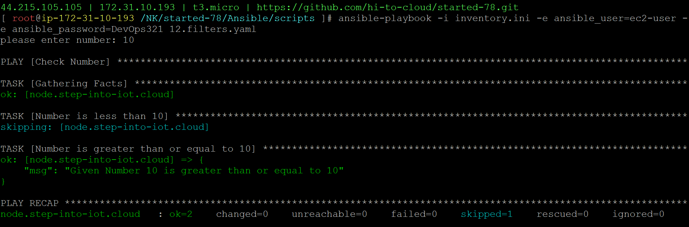

### Filters

12.filters.yaml
```
- name: Check Number
  hosts: node
  vars_prompt: #prompts are always considered as text/string
  - name: NUMBER
    prompt: please enter number
    private: no
  tasks:
  - name: Number is less than 10
    ansible.builtin.debug:
      msg: "Given number {{NUMBER}} is less than 10"
    when: NUMBER | int < 10

  - name: Number is greater than or equal to 10
    ansible.builtin.debug:
      msg: "Given Number {{NUMBER}} is greater than or equal to 10"
    when: NUMBER | int >= 10
```
```
ansible-playbook -i inventory.ini -e ansible_user=ec2-user -e ansible_password=DevOps321 12.filters.yaml
```
#### playbook execution
