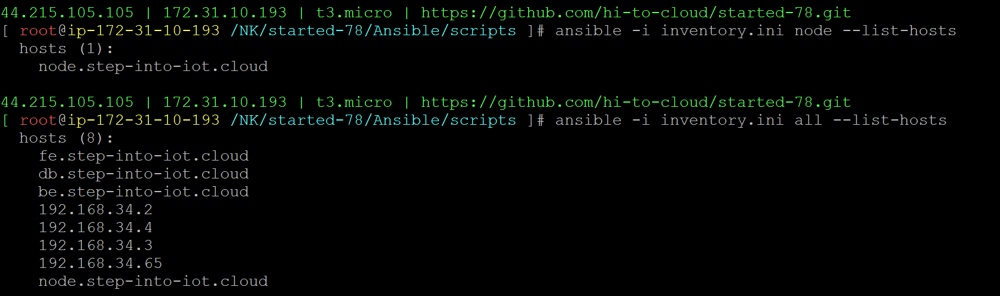

### inventory
group of servers, list of hosts\
inventory.ini
```
192.168.34.2 #ungrouped

[node] #grouped as node
node.step-into-iot.cloud

[fe]
fe.step-into-iot.cloud

[db]
db.step-into-iot.cloud

[be]
be.step-into-iot.cloud

[all:children] #execute all hosts
fe
db
be
```
```
ansible -i inventory.ini node --list-hosts
```
```
ansible -i inventory.ini all --list-hosts
```
